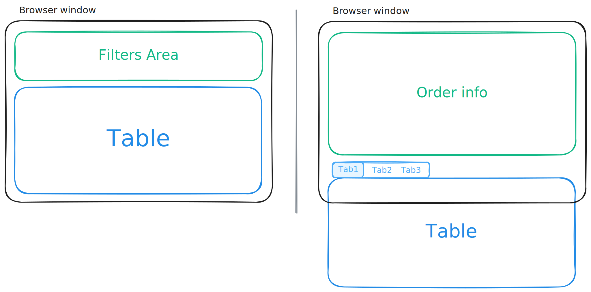
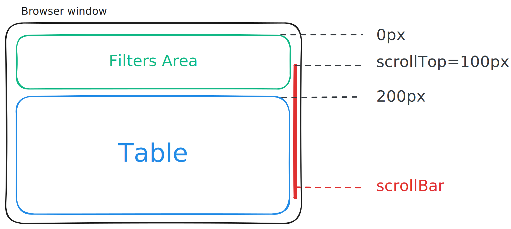

## Virtualize 🚧

### VirtualTable

` @are-visual/virtual-table` 是一个基于插件机制实现的虚拟表格组件，仅支持 React。

#### Install

```bash
npm install @are-visual/virtual-table

yarn add @are-visual/virtual-table

pnpm install @are-visual/virtual-table
```

#### Usage

```tsx
import type { ColumnType } from '@are-visual/virtual-table'
import { VirtualTable } from '@are-visual/virtual-table'

interface User {
  id: number
  name: string
  age: number
}

const dataSource: User[] = [
  { id: 1, name: 'Allen', age: 26 },
  { id: 2, name: 'Andrew', age: 43 },
  { id: 3, name: 'Max', age: 12 },
]

const columns: ColumnType<User>[] = [
  {
    dataIndex: 'id',
    title: 'UID',
    render(value) {
      return `#${value}`
    },
  },
  {
    dataIndex: 'name',
    title: 'Username',
  },
  {
    dataIndex: 'age',
    title: 'Age',
    align: 'right',
  },
  {
    key: 'actions',
    title: 'Action',
    render(value, record, index) {
      return (
        <button type="button">View details</button>
      )
    },
  },
]

function App() {
  return (
    <VirtualTable
      rowKey="id"
      dataSource={dataSource}
      columns={columns}
      estimatedRowHeight={37}
    />
  )
}
```

#### Columns 定义

| Prop Name    | 说明                                                         | 类型                                      | 默认值 | 版本 |
| ------------ | ------------------------------------------------------------ | ----------------------------------------- | ------ | ---- |
| key          | React 需要的 key 属性，如果已经指定了唯一的 dataIndex，可忽略此属性 | Key                                       |        |      |
| dataIndex    | 指定 dataSource 中的 key 用于单元格内容展示                  | string                                    |        |      |
| className    | 每列样式名称                                                 | string                                    |        |      |
| colSpan      | **表头**列合并，设置为 0 时，不渲染                          | number |        |      |
| title        | 表头内容                                                     | ReactNode |        |      |
| align        | 单元格对齐方式                                               | `left` \|`right` \|`center` |        |      |
| minWidth     | 列最小宽度                                                   | number                                    |        |      |
| width        | 列宽度                                                       | number \| string                          |        |      |
| fixed        | 固定列                                                       | `left` | `right` |                           |        |
| render       | 自定义单元格渲染内容                                         | (*value*, *record*, *index*) => ReactNode |        |      |
| onHeaderCell | 设置表头单元格属性 | (column,  index) => TdHTMLAttributes                          |        |      |
| onCell       | 设置单元格属性 | (column,  index) => TdHTMLAttributes |        |      |

#### Table Props

| Prop Name          | 说明                                                    | 类型                                    | 默认值                         | 版本 |
| ------------------ | ------------------------------------------------------- | --------------------------------------- | ------------------------------ | ---- |
| ref                | 设置最外层 div ref                                      | Ref\<HTMLDivElement\>                   |                                |      |
| tableBodyRef       | 设置 body 部分 table ref                                | Ref\<HTMLTableElement\>                 |                                |      |
| className          | 样式类名                                                | string                                  |                                |      |
| style              | 样式                                                    | CSSProperties                           |                                |      |
| tableBodyClassName | body 样式类名                                           | string                                  |                                |      |
| tableBodyStyle     | body 样式                                               | CSSProperties                           |                                |      |
| columns            | 表格列配置                                              | ColumnType[]                            |                                |      |
| dataSource         | 表格数据源                                              | object[]                                |                                |      |
| rowKey             | 表格行 key 的取值                                       | string                                  | `key`                          |      |
| estimatedRowHeight | 预计每行高度                                            | number                                  |                                |      |
| overscanRows       | 额外在首尾渲染数据条数                                  | number                                  | 5                              |      |
| stickyHeader       | 表头吸顶<br />为 true 时 top 为 0，为 number 则是偏移量 | number \| boolean                       |                                |      |
| pipeline           | 插件实例                                                | TablePipeline                           |                                |      |
| rowClassName       | 表格行样式类名                                          | (*record*, *index*) => string           |                                |      |
| onRow              | 设置行属性                                              | (*record*, *index*) => TdHTMLAttributes |                                |      |
| getOffsetTop       | 计算顶部偏移量                                          | () => number                            | 使用 最外层 div 计算 offsetTop |      |

#### getOffsetTop



例如上图所示，业务开发中的常见布局形式，绿色部分即为 Table 组件之前的**额外区域**，若这一部分的 DOM 高度较高，滚动会导致可视区域内容计算出错，导致 Table 存在空白部分。

在虚拟列表的实现中，当滚动事件触发时，需要使用 `scrollTop` 与最接近滚动容器顶部的元素（锚点元素）位置进行比较，再得出最新的数据可视范围。


如上图所示，当 Table 与滚动容器的上边缘相交时，数据可视范围计算才可以开始计算。而正是因为额外区域的存在，导致 Table 与滚动容器上边缘相交前，可视数据范围的计算便已经触发了，造成 Table 中存在空白行。

所以，`@are-visual/virtual-table` 提供了 `getOffsetTop` 属性，用于得知额外区域的具体高度，这样在数据可视范围计算时才能避免这个问题。

一般来说，你不太需要关注 `getOffsetTop`，因为它有一个默认实现：使用 table 的 DOM 节点访问 offsetTop 属性作为偏移量。

`getOffsetTop` 总是会在滚动事件中反复调用。

> 关于 `getOffsetTop` 的默认实现是否会造成额外重排/性能影响，还有待验证。若你实在担心，可以设置 getOffsetTop 以覆盖默认实现。

#### 插件

`@are-visual/virtual-table` 提供一个 `useTablePipeline` hook 用于组合各种插件，为 Table 增加各式各样的功能。

目前插件列表：

- [columnResize 列宽调整](./packages/virtual-table/src/middleware/column-resize)
- [tableEmpty 空提示](./packages/virtual-table/src/middleware/empty)
- [tableExpandable 行展开](./packages/virtual-table/src/middleware/expandable)
- [horizontalScrollBar 水平滚动条](./packages/virtual-table/src/middleware/horizontal-scroll-bar)
- [tableLoading 加载状态](./packages/virtual-table/src/middleware/loading)
- [tableSelection 数据选择](./packages/virtual-table/src/middleware/selection)
- [tableSummary 总结栏](./packages/virtual-table/src/middleware/summary)

```tsx
import '@are-visual/virtual-table/middleware/selection/styles.scss'
import { tableSelection } from '@are-visual/virtual-table/middleware/selection'

import '@are-visual/virtual-table/middleware/loading/styles.scss'
import { tableLoading } from '@are-visual/virtual-table/middleware/loading'

import { useState, type Key } from 'react'
import { useTablePipeline, VirtualTable } from '@are-visual/virtual-table'

function App() {
  const [selectedRowKeys, setSelectedRowKeys] = useState<Key[]>([])

  const pipeline = useTablePipeline({
    use: [
      // 数据选择插件
      tableSelection({
        selectedRowKeys,
        onChange(selectedRowKeys, selectedRows, info) {
          setSelectedRowKeys(selectedRowKeys)
        },
      }),
      
      // loading 插件
      tableLoading({ loading: false })
    ],
  })

  return (
    <VirtualTable
      pipeline={pipeline}
      rowKey="id"
      dataSource={dataSource}
      columns={columns}
      estimatedRowHeight={37}
    />
  )
}
```

#### 自定义插件

插件本身就是一个 react hook，它接受 `@are-visual/virtual-table` 传递的数据，处理再返回。

遵循下面这样的公式。当多个插件一起使用时，前一个插件返回的 context 会成为下一个插件所接收到的 context，所以这就是 pipeline。


##### 插件 context 定义

| key          | 说明                     | 类型         | 版本 |
| ------------ | ------------------------ | ------------ | ---- |
| dataSource   | 表格数据源               | object[]     |      |
| columns      | 表格列配置               | ColumnType[] |      |
| rowKey       | 表格行 key 的取值        | string       |      |
| visibleRowSize | 当前虚拟化下所显示的行数 | number       |      |
| estimatedRowHeight | 预计每行高度 | number       |      |

##### 插件返回值定义

| key           | 说明                     | 类型                                    | 版本 |
| ------------- | ------------------------ | --------------------------------------- | ---- |
| dataSource    | 表格数据源               | object[]                                |      |
| columns       | 表格列配置               | ColumnType[]                            |      |
| rowKey        | 表格行 key 的取值        | string                                  |      |
| visibleRowSize  | 当前虚拟化下所显示的行数 | number                                  |      |
| rowClassName  | 自定义表格行 class       | (*record*, *index*) => string           |      |
| onRow         | 设置行属性               | (*record*, *index*) => TdHTMLAttributes |      |
| render | 自定义 Table 外层渲染 | MiddlewareRender| |
| renderRoot | 自定义 div.virtual-table 渲染 | MiddlewareRenderRoot| |
| renderContent |  | MiddlewareRenderContent| |
| renderHeaderWrapper | | MiddlewareRenderHeaderWrapper| |
| renderHeaderRoot | | MiddlewareRenderHeaderRoot| |
| renderHeader | Header 自定义渲染 | MiddlewareRenderHeader| |
| renderHeaderRow | 表头行自定义渲染 | MiddlewareRenderHeaderRow| |
| renderHeaderCell | 表头单元格自定义渲染 | MiddlewareRenderHeaderCell| |
| renderBodyWrapper | | MiddlewareRenderBodyWrapper| |
| renderBodyRoot | | MiddlewareRenderBodyRoot| |
| renderBody | 表格 body 自定义渲染 | MiddlewareRenderBody| |
| renderRow | 表格行自定义渲染 | MiddlewareRenderRow| |
| renderCell | 单元格自定义渲染 | MiddlewareRenderCell| |

> 出于性能考虑，请自行 memo render 函数

##### Render 结构

```
Context
└── render(<TableRoot />)
    │
    └── renderRoot(div.virtual-table)
        │
        └── renderContent(<><TableHeader/><TableBody/></>)
            │
            ├── renderHeaderWrapper(<TableHeader />) div.virtual-table-header
            │   │
            │   └── renderHeaderRoot(<table />)
            │       ├── colgroup
            │       │
            │       └── renderHeader(<thead />)
            │           └── renderHeaderRow(<tr />)
            │               └── renderHeaderCell(<th />)
            │
            └── renderBodyWrapper(<TableBody />) div.virtual-table-body-wrapper
                │
                └── renderBodyRoot(table.virtual-table-body)
                    ├── colgroup
                    │
                    └── renderBody(<tbody />)
                        └── renderRow(<tr />)
                            └── renderCell(<td />)
```

##### Render 类型签名

```ts
interface RenderOptions<T = any> {
  column: ColumnType<T>
  columnIndex: number
  columnWidthList: number[]
  rowIndex: number
  columns: ColumnType<T>[]
  rowData: T
}

type MiddlewareRender<T = any> = (
  children: ReactNode,
  options: Pick<RenderOptions<T>, 'columns'>,
) => ReactNode

type MiddlewareRenderRoot<T = any> = (
  children: ReactNode,
  options: Omit<RenderOptions<T>, keyof RenderOptions<T>>,
) => ReactNode

type MiddlewareRenderContent<T = any> = (
  children: ReactNode,
  options: Pick<RenderOptions<T>, 'columns'>,
) => ReactNode

type MiddlewareRenderHeaderWrapper<T = any> = (
  children: ReactNode,
  options: Pick<RenderOptions<T>, 'columns'>,
) => ReactNode

type MiddlewareRenderHeaderRoot<T = any> = (
  children: ReactNode,
  options: Pick<RenderOptions<T>, 'columns'>,
) => ReactNode

type MiddlewareRenderHeader<T = any> = (
  children: ReactNode,
  options: Pick<RenderOptions<T>, 'columns'>,
) => ReactNode

type MiddlewareRenderHeaderRow<T = any> = (
  children: ReactNode,
  options: Pick<RenderOptions<T>, 'columns'>,
) => ReactNode

type MiddlewareRenderHeaderCell<T = any> = (
  children: ReactNode,
  options: Pick<
    RenderOptions<T>,
    'columns' | 'column' | 'columnIndex' | 'columnWidthList'
  >,
) => ReactNode

type MiddlewareRenderBodyWrapper<T = any> = (
  children: ReactNode,
  options: Pick<RenderOptions<T>, 'columns'>,
) => ReactNode

type MiddlewareRenderBodyRoot<T = any> = (
  children: ReactNode,
  options: Pick<RenderOptions<T>, 'columns'>,
) => ReactNode

type MiddlewareRenderBody<T = any> = (
  children: ReactNode,
  options: Pick<RenderOptions<T>, 'columns'>,
) => ReactNode

type MiddlewareRenderRow<T = any> = (
  children: ReactNode,
  options: Pick<RenderOptions<T>, 'columns' | 'rowIndex' | 'rowData'>,
) => ReactNode

type MiddlewareRenderCell<T = any> = (
  children: ReactNode,
  options: Pick<RenderOptions<T>, 'column' | 'columnIndex'>,
) => ReactNode
```

##### 插件编写

由于插件只是一个 react hook，可以直接这样写

```ts
import type { MiddlewareContext, MiddlewareResult } from '@are-visual/virtual-table'

function useLog<T = any>(ctx: MiddlewareContext<T>): MiddlewareResult<T> {
  console.log('useLog 中间件被调用')
  return ctx
}

// 使用插件
const pipeline = useTablePipeline({
  use: [
    useLog,
  ],
})
```

携带参数

```ts
// 方式 1
const withLog = (options?: { prefix: string }) => {
  function useLog<T = any>(ctx: MiddlewareContext<T>): MiddlewareResult<T> {
    console.log(options?.prefix, 'useLog 中间件被调用')
    return ctx
  }

  return useLog
}

// 使用插件
const pipeline = useTablePipeline({
  use: [
    withLog({ prefix: '🎯' }),
  ],
})
```

注意上述 withLog 的实现方式，一些与表格无关的渲染被触发时，withLog 依然会返回一个新的函数，这对于 diff 是有害的，总是会导致 Table 的额外渲染，如果你的插件不需要参数，那就没有影响，否则请使用 `createMiddleware` 创建插件。

##### 使用 createMiddleware 创建插件

```ts
import { createMiddleware } from '@are-visual/virtual-table'

function useLog<T = any>(ctx: MiddlewareContext<T>, options?: { prefix: string }): MiddlewareResult<T> {
  console.log(options?.prefix, 'useLog 中间件被调用')
  return ctx
}

const withLog = createMiddleware(useLog)

// 使用插件
const pipeline = useTablePipeline({
  use: [
    withLog({ prefix: '🎯' }),
  ],
})
```

`createMiddleware` 会缓存插件的 options 参数，并在每一次渲染阶段进行一次比较，options 不同时才会返回新的函数，这样有利于避免 Table 进行一些额外的渲染。

#### 插件注意事项

由于插件是一个 react hook，所以也需要遵守 [react hooks 规则](https://react.dev/reference/rules/rules-of-hooks)，不能在循环、判断条件中使用。

下面这种方式便是错误的，它违反了 hooks 规则，hook 不能位于判断条件中使用。

```tsx
const pipeline = useTablePipeline({
  use: [
    enableSelection ? tableSelection({}) : null,
    loading ? tableLoading({}) : null,
  ],
})
```


### 参考

[浅说虚拟列表的实现原理](https://github.com/dwqs/blog/issues/70)

[ali-react-table](https://ali-react-table.js.org/)

[rc-table](https://github.com/react-component/table)

[antd](https://ant.design/)

