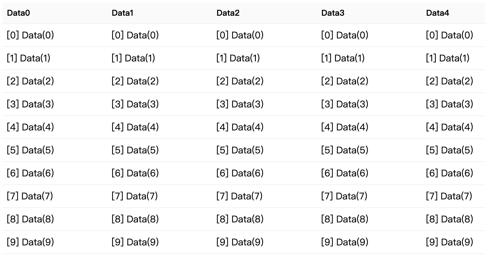
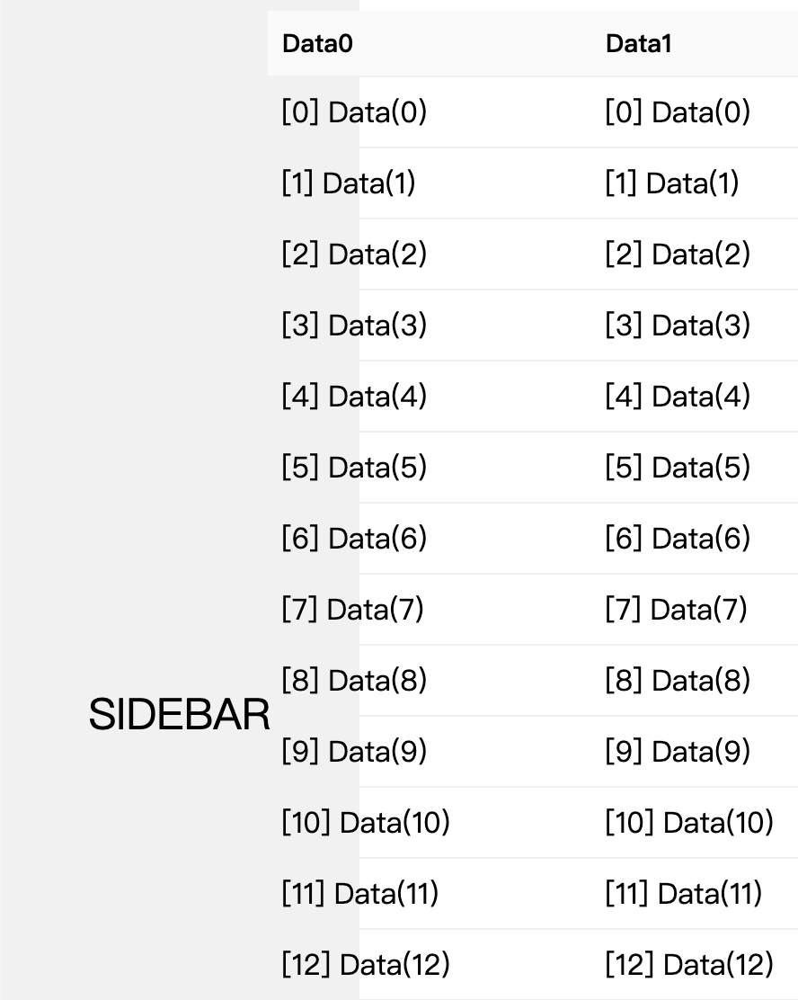
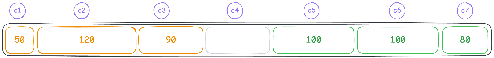
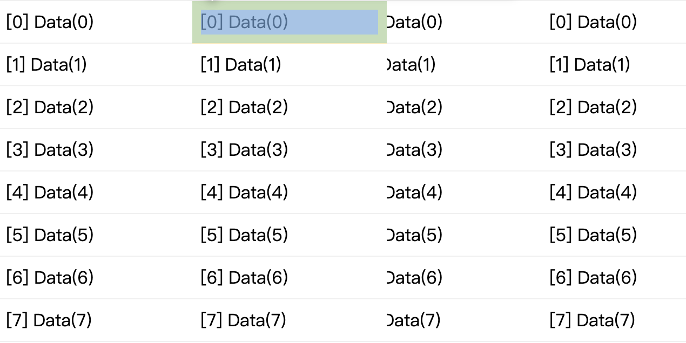
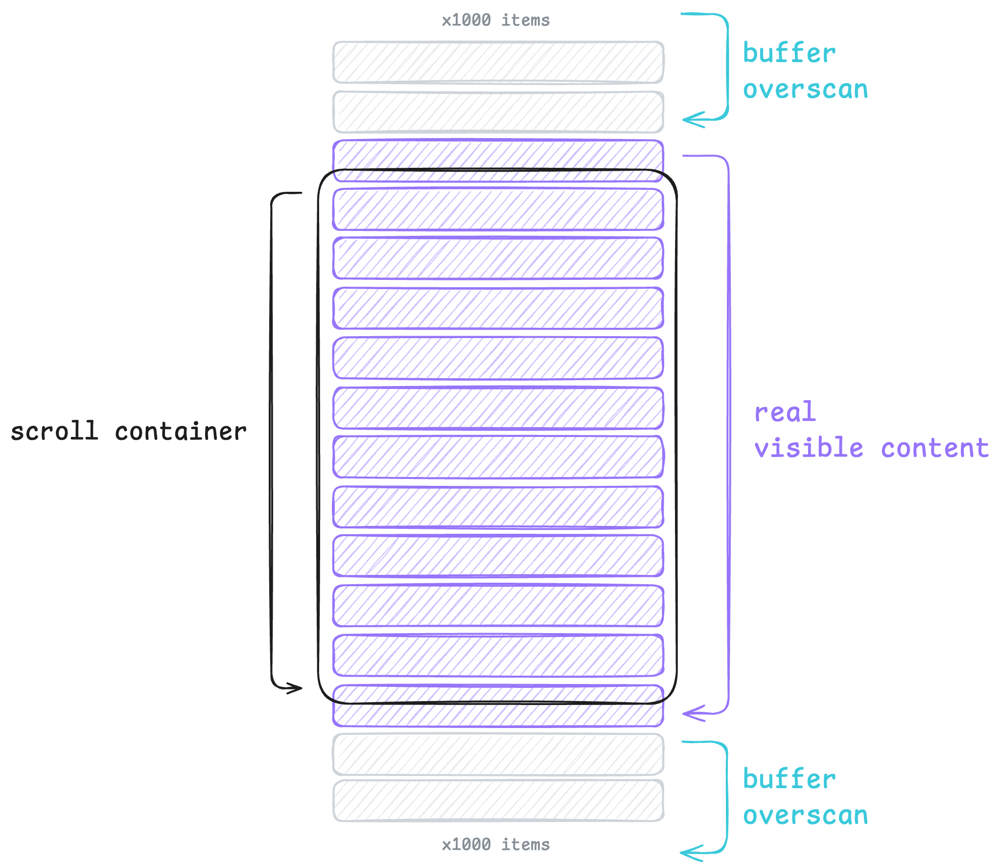
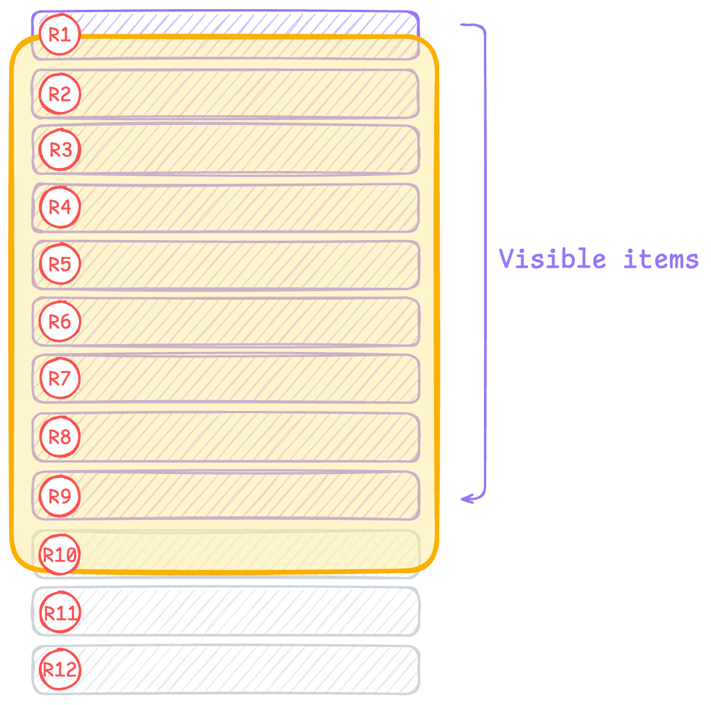
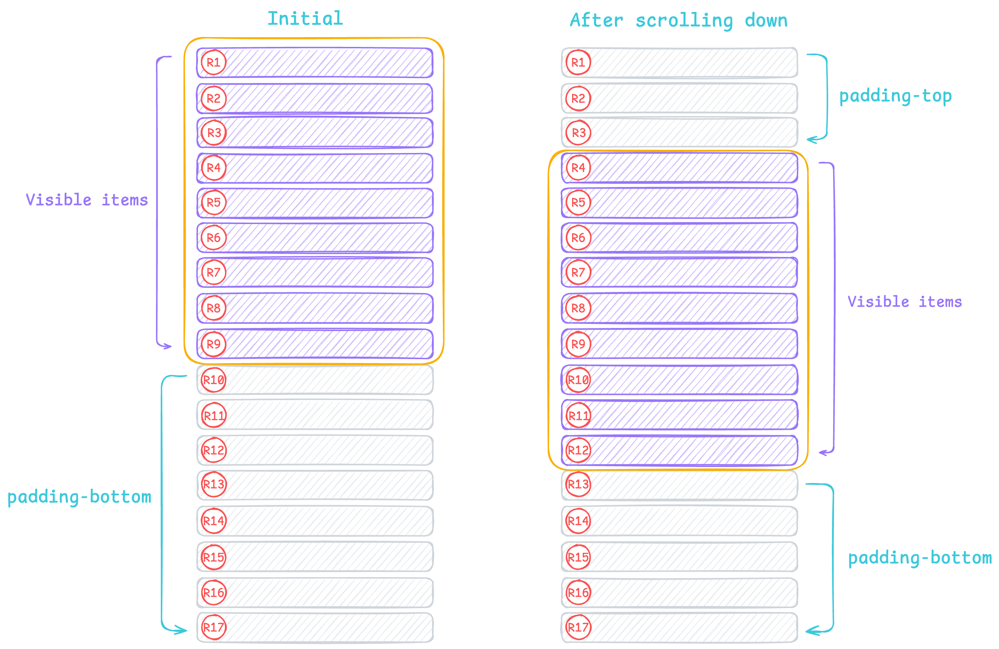
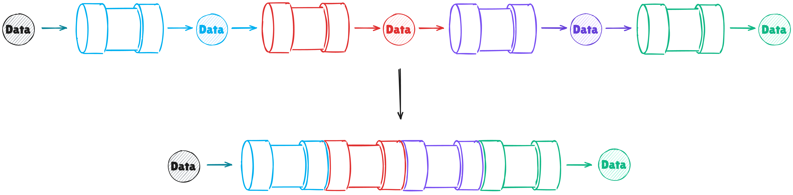
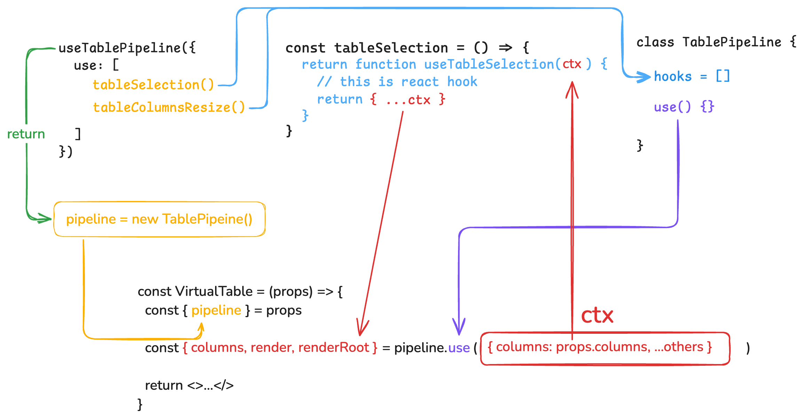

## ☄️ 序
话说天下大势，分久必合，合久必分……

2022 年<br/> antd 4.x Table 组件**不支持**虚拟列表，我们有个纯编辑态的 Table 同时还支持新增、删除行，且需要展示 100/300/500 条/页。当时使用 `react-window` 做了虚拟列表的实现，但是没有上生产环境，忘了什么原因。

2024 年<br/> antd 5.x Table 组件原生**支持**虚拟列表，他们有多个纯编辑态的 Table……但是使用后却比较卡顿，页面滚动时掉帧，肉眼可见（大概 30 列左右）。

这天，老朋友找到我，和我吐槽这件事。<br/>那么，来实现一个 Virtual Table 吧，不仅能帮到他，我自己也能使用，而且还能体验造轮子的快乐。

20XX 年<br/> 你有一个纯编辑态的 Table...

## 🎯 设计 & 🏗️ 实现

> 笔者尝试过使用 antd Table 提供的 components + react-window 来实现虚拟化。虽然成功实现虚拟列表，但是有以下几点原因放弃继续实现。<br/>
> 1. 因为表格的特殊性，column.width 与渲染结果某些情况下并非完全一致，而 react-window 默认使用 absolute，导致无法使用 colgroup 标签控制列宽。
> 2. 自定义 body 意味着 antd Table 所有功能全部失效（列固定、 展开、选择等），需要重新实现。
> 3. 仅仅自定义 body 时，还要与默认的 head 进行适配，同步滚动、列固定。
> 4. 既然重写了全部功能，那也没必要留着 antd Table 这个躯壳。

### 目标
首先，我们要搞清楚，我们**短期内**需要什么？

 1. 虚拟化的 Table，可自适应容器或者 window。
 2. 尽量能够方便适配 antd API，这样才能减少已存在代码的修改。

OK，明确之后，那就：**Let's make a shit.** 😆

### Step 0: 起步
我们要设计的就是一个 Table 组件，任何功能都先抛开，先把 Table 实现了，其他事情才有可能。

因为我们参考的是 antd 的 API，所以我们先定义一下 Table 的 Props。<br/>在 antd 中，column 内 `dataIndex` 和 `key` 二选一，都是作为列的 `key` 存在，antd 没有对它进行类型约束，所以这两个都不填写也不报错，但是我希望这两个二选一，必填。

```ts
// virtual-table/types.ts
import type { Key, ReactNode } from 'react'

export type AnyObject = Record<string, any>

interface ColumnTypeCommon<T> {
  width?: string | number
  minWidth?: number
  title?: ReactNode
  render?: (value: any, record: T, index: number) => ReactNode
}

type ColumnTypeWithKey<T> = ColumnTypeCommon<T> & {
  key: Key
  [key: string]: unknown
}

type ColumnTypeWithDataIndex<T> = ColumnTypeCommon<T> & {
  // 这个联合类型能够给你提示 T 类型中所有的 key，同时也允许你自定义任意 string 而不报错
  dataIndex: keyof T | (string & {})
  [key: string]: unknown
}

export type ColumnType<T> = ColumnTypeWithKey<T> | ColumnTypeWithDataIndex<T>
```

```tsx
// virtual-table/utils/get-key.ts
import type { Key } from 'react'
import type { ColumnType } from '../types'

export function getKey<T>(column: ColumnType<T>) {
  return 'key' in column ? (column.key as Key) : column.dataIndex as string
}
```

```tsx
// virtual-table/table.tsx
import './style.scss'

import type { AnyObject, ColumnType } from './types'
import { getKey } from './utils/get-key'

export interface VirtualTableProps<T> {
  rowKey: keyof T | (string & {})
  columns: ColumnType<T>[]
  dataSource?: T[]
}

function getTableCellContent<T extends AnyObject>(
  index: number,
  data: T,
  column: ColumnType<any>,
) {
  const { render } = column
  const rowData = data as AnyObject
  if ('dataIndex' in column) {
    const dataIndex = column.dataIndex as string
    if (typeof render !== 'function') {
      return String(rowData[dataIndex])
    }
    return render(rowData[dataIndex], data, index)
  }
  return render?.(data, data, index) ?? null
}

function VirtualTable<T>(props: VirtualTableProps<T>) {
  const { rowKey, dataSource, columns } = props

  return (
    <table className="virtual-table">
      <colgroup>
        {columns.map((column, columnIndex) => {
          const key = getKey(column)
          return (
            <col
              key={typeof key === 'symbol' ? columnIndex : key}
              style={{ width: column.width, minWidth: column.minWidth }}
            />
          )
        })}
      </colgroup>
      <thead className="virtual-table-header">
        <tr>
          {columns.map((column, columnIndex) => {
            const key = getKey(column)
            return (
              <td
                className="virtual-table-header-cell"
                key={typeof key === 'symbol' ? columnIndex : key}
              >
                {column.title}
              </td>
            )
          })}
        </tr>
      </thead>
      <tbody className="virtual-table-body">
        {dataSource?.map((e, rowIndex) => {
          const rowData = e as AnyObject
          const key = rowData[rowKey as string]
          return (
            <tr key={key}>
              {columns.map((column, columnIndex) => {
                const columnKey = getKey(column)
                return (
                  <td
                    key={typeof columnKey === 'symbol' ? columnIndex : columnKey}
                    className="virtual-table-cell"
                  >
                    {getTableCellContent(rowIndex, rowData, column)}
                  </td>
                )
              })}
            </tr>
          )
        })}
      </tbody>
    </table>
  )
}

export default VirtualTable
```

这样一来，我们这个 Table 组件就正常工作了，接下来实现相应的功能就可以了。



[查看源码](https://github.com/Y-Hui/virtualize/tree/main/packages/tutorial/src/components/virtual-table_step0)<br/>
[查看在线 Demo](https://y-hui.github.io/virtualize/tutorial/#/step/0)

### Step 1: 容器自适应
我们最终的目标是在容器内/window 进行表格虚拟化。上面的代码运行后，由于没有滚动容器，会尽可能撑开 body，布局无法自适应容器，会造成下面这种效果。



表格内容超出容器，滚动时覆盖了 sidebar，正常来讲，一个左右布局的后台页面，Table 应当占满右侧内容区域，并在 Table 内部水平滚动，不影响整个网页。

目前可以有两种方案：
1. 编写文档告知用户自行设置 CSS 实现 columns 较多时开启水平滚动。
2. 改变目前的布局，以达到自适应的需求。

在这里，我们采用方案 2，因为方案 1 不能够做到组件开箱即用，与我们的目标不匹配。

table 内部进行水平滚动非常简单，我们在外层包裹一个 div 元素，并设置下面的样式：
```scss
.virtual-table-wrapper {
    overflow: auto hidden;
}
```
直接在 table 上使用 `overflow` 是没有效果的，必须在外层添加容器。

[查看源码](https://github.com/Y-Hui/virtualize/tree/main/packages/tutorial/src/components/virtual-table_step1)<br/>
[查看在线 Demo](https://y-hui.github.io/virtualize/tutorial/#/step/1)

### Step 2: Table Head 吸顶
实现目标：
1. 当 table 处于滚动容器内部，则 head 在容器内吸顶。
2. 当 table 没有滚动容器时，吸顶 window。

我们知道，在 Web 中实现吸顶非常简单，只需要设置 `position: sticky` 即可。那么 table 同理，在 thead 元素设置 sticky 即可。

但是我们会发现它并不生效，不能吸顶 window。因为我们在 Step1 中修改了布局，在 table 外层添加了 `overflow: auto hidden` 样式，形成了一个水平可滚动垂直方向禁用的滚动容器，[抑制了 head sticky 的效果](https://developer.mozilla.org/en-US/docs/Web/CSS/position#sticky)。

是不是我们在 Step1 中做错了？我们不改变布局，也就没有这样的烦恼。<br/>
然而，并不是这样。即使我们不改变布局，当 columns 过多时，依然会触发 body 水平滚动，导致容器被撑开，影响网页。<br/>
既然如此，开发者会怎么做呢？像 Step1 中一样，设置 `overflow` 形成一个水平滚动容器，这样就能在 table 内滚动了。<br/>
问题又回来了，因为设置了 `overflow` 所以形成了滚动容器，导致 sticky 效果被限制在容器内，无法吸顶 window。

为了实现我们的目标，我们可以再一次修改布局。

```html
<div>
  <div class="virtual-table-header-wrapper">
    <table>
      <thead />
    </table>
  </div>

  <div class="virtual-table-body-wrapper">
    <table>
      <tbody />
    </table>
  </div>
</div>
```

把 head 与 body 分别分离到不同的容器内，各自实现水平滚动。<br/>
这样，我们给 head 部分设置 sticky 就能够与 window 吸顶了，而且若开发者在 table 外层设置一个滚动容器，那么也可以在容器内吸顶。

虽然这样的布局能够达成我们的目标，但是也有问题——需要实现 head 与 body 的横向滚动同步。

```tsx
// virtual-table/table.tsx
function VirtualTable<T>(props: VirtualTableProps<T>) {
  const { rowKey, dataSource, columns } = props

  const colGroup = (省略)

  const headWrapper = useRef<HTMLDivElement>(null)
  const bodyWrapper = useRef<HTMLDivElement>(null)

  // 横向滚动同步
  useEffect(() => {
    const head = headWrapper.current
    const body = bodyWrapper.current
    if (head == null || body == null) return
    const nodes = [head, body]

    const rAF = (fn: () => void) => {
      if (typeof window.requestAnimationFrame === 'function') {
        window.requestAnimationFrame(() => {
          fn()
        })
      } else {
        fn()
      }
    }

    const skipEventNodes = new Set<HTMLElement>()
    const onScroll = (e: Event) => {
      const element = e.target as HTMLElement
      if (skipEventNodes.has(element)) {
        skipEventNodes.delete(element)
        return
      }
      nodes.forEach((node) => {
        if (node === element) return
        skipEventNodes.add(node)
        rAF(() => {
          // 设置 scrollLeft 后会触发 scroll 事件
          // 但是此处正在进行滚动同步，所以要忽略 node 所触发的 scroll 事件
          // 使用 skipEventNodes 来记录 node 并跳过
          node.scrollLeft = element.scrollLeft
        })
      })
    }

    nodes.forEach((node) => {
      node.addEventListener('scroll', onScroll)
    })

    return () => {
      nodes.forEach((node) => {
        node.removeEventListener('scroll', onScroll)
      })
    }
  }, [])

  return (
    <div className="virtual-table-wrapper">
      <div ref={headWrapper} className="virtual-table-header-wrapper">
        <table className="virtual-table-header-root">
          {colGroup}
          <thead className="virtual-table-header">
            <tr>
              {省略}
            </tr>
          </thead>
        </table>
      </div>

      <div ref={bodyWrapper} className="virtual-table-body-wrapper">
        <table className="virtual-table-body-root">
          {colGroup}
          <tbody className="virtual-table-body">
            {省略}
          </tbody>
        </table>
      </div>
    </div>
  )
}
```
[查看源码](https://github.com/Y-Hui/virtualize/tree/main/packages/tutorial/src/components/virtual-table_step2)<br/>
[查看在线 Demo](https://y-hui.github.io/virtualize/tutorial/#/step/2)

### Step 3: 固定列
固定列的实现比较简单，同样是使用 sticky。
```ts
type FixedType = 'left' | 'right'

interface ColumnTypeCommon<T> {
  width?: string | number
  minWidth?: number
  title?: ReactNode
  render?: (value: any, record: T, index: number) => ReactNode

  // 新增固定列的参数
  fixed?: FixedType
}
```

实现步骤：
1. 判断 `fixed` 并设置 `left` 和 `right` 的具体数值。
2. 由于 `width` 的类型为 `string | number`，不能直接使用此值进行计算，所以我们需要测量列宽。



计算 `left` 和 `right` 非常简单，如图所示，橙色的部分固定在左侧，绿色部分固定在右侧。
我们进行计算：

`c1`：由于它是第一个固定在`左侧`的元素，所以 `left: 0`<br/>
`c2`：它是第二个固定在左侧的元素，而且滚动时，要紧贴着 c1，所以 `left: 50px`<br/>
`c3`：它是第三个固定在左侧的元素，而且滚动时，要紧贴着 c2，所以 `left: 50px + 120px`

现在，我们发现了规律，c3 的 left 其实就是 c1 + c2的宽度，那么 c4 就是 c1 + c2 + c3。<br/>由于 c1 是第一个，它自己不需要增加，所以为 0。

有了前面的经验，我们举一反三，计算 right 值，不过要注意，right 与 left 的计算是相反的。

`c7`：它是第一个固定在`右侧`的元素，所以 `right: 0`<br/>
`c6`：它是第二个固定在右侧的元素，而且滚动时，要紧贴着 c7，所以 `left: 80px`<br/>
`c5`：它是第二个固定在右侧的元素，而且滚动时，要紧贴着 c6，所以 `left: 80px + 100px`<br/>

我们计算 `right` 时，需要从右往左算，c7 才是第一个固定在右侧的元素，和前面一样，所以它的 right 才应该是 0.

计算方案我们已经有了，但是由于 `width` 的类型为 `string | number`，所以开发者可能会这样配置 columns。

```ts
const columns = [
  {
    // 这是最理想的情况，number 类型能够直接计算
    width: 180,
  },
  {
    // 携带单位
    width: '180px',
  },
  {
    // 使用相对单位，无法得知列宽
    width: '10%',
  },
  {
    // 仅设置 min-width，没有准确的列宽
    minWidth: 100,
  },
]
```

正因如此，我们才需要测量列宽，获取准确的 DOM 宽度。

前面我们使用 `<colgroup>` `<col>` 元素控制表格的列宽，那么我们也可以在这里进行宽度测量。

```tsx
interface ColgroupProps<T> {
  columns: ColumnType<T>[]
  onColumnSizesMeasure?: (columnSizes: Map<Key, number>) => void
}

function Colgroup<T>(props: ColgroupProps<T>) {
  const { columns, onColumnSizesMeasure } = props

  const enableMeasure = onColumnSizesMeasure != null
  const columnSizes = useRef(new Map<Key, number>())

  return (
    <colgroup
      ref={() => {
        if (!enableMeasure) return
        onColumnSizesMeasure(columnSizes.current)
      }}
    >
      {columns.map((column, columnIndex) => {
        const key = getKey(column)
        return (
          <col
            key={typeof key === 'symbol' ? columnIndex : key}
            ref={(node) => {
              if (node == null || !enableMeasure) return
              columnSizes.current.set(key, node.offsetWidth)
            }}
            style={{ width: column.width, minWidth: column.minWidth }}
          />
        )
      })}
    </colgroup>
  )
}
```

```tsx
function VirtualTable<T>(props: VirtualTableProps<T>) {
  const { columns } = props

  // 省略其他代码

  const [columnSizes, setColumnSizes] = useState(() => new Map<Key, number>())

  return (
    <div className="virtual-table">
      <div className="virtual-table-header-wrapper">
        <table className="virtual-table-header-root">
          <Colgroup columns={columns} />
          {/* 省略 */}
        </table>
      </div>

      <div className="virtual-table-body-wrapper">
        <table className="virtual-table-body-root">
          <Colgroup
            columns={columns}
            onColumnSizesMeasure={(e) => {
              // TODO: 对比数据是否变化再更新
              setColumnSizes(e)
            }}
          />
          {/* 省略 */}
        </table>
      </div>
    </div>
  )
}
```

上面的步骤完成后，我们就得到了准确的列宽，可以编写计算 `left` 和 `right` 的逻辑了。

```ts
const stickySizes = useMemo(() => {
  const result = new Map<Key, number>()

  // 从左侧开始遍历
  columns.reduce((left, column) => {
    if (column.fixed != null && ['left', 'right'].includes(column.fixed)) {
      const key = getKey(column)
      const size = columnSizes.get(key) ?? 0
      if (column.fixed === 'left') {
        result.set(key, left)
        return left + size
      }
    }
    return left
  }, 0)

  // right 从右边开始遍历
  columns.reduceRight((right, column) => {
    if (column.fixed != null && ['left', 'right'].includes(column.fixed)) {
      const key = getKey(column)
      const size = columnSizes.get(key) ?? 0
      if (column.fixed === 'right') {
        result.set(key, right)
        return right + size
      }
    }
    return right
  }, 0)

  return result
}, [columnSizes, columns])
```

再编写一个函数，传入 column 并返回样式
```ts
const lastFixedLeftColumnKey = columns.reduce<Key | undefined>((result, x) => {
  if (x.fixed === 'left') {
    return getKey(x)
  }
  return result
}, undefined)
const firstFixedRightColumn = columns.find((x) => x.fixed === 'right')
const firstFixedRightColumnKey = firstFixedRightColumn == null ? undefined : getKey(firstFixedRightColumn)

const calcFixedStyle = (column: ColumnType<any>): { className: string, style?: CSSProperties } => {
  if (column.fixed != null && ['left', 'right'].includes(column.fixed)) {
    const key = getKey(column)
    const isLeft = column.fixed === 'left'
    const isRight = column.fixed === 'right'
    return {
      className: clsx('virtual-table-sticky-cell', {
        'virtual-table-cell-fix-left-last': isLeft && lastFixedLeftColumnKey === key,
        'virtual-table-cell-fix-right-first': isRight && firstFixedRightColumnKey === key,
      }),
      style: {
        left: isLeft ? stickySizes.get(key) : undefined,
        right: isRight ? stickySizes.get(key) : undefined,
      },
    }
  }
  return {
    className: '',
  }
}
```

为了逻辑聚合，我们写一个 hook
```ts
interface UseColumnStickyArgs {
  columns: ColumnType<any>[]
  columnSizes: Map<Key, number>
}

export function useColumnSticky(args: UseColumnStickyArgs) {
  const { columns, columnSizes } = args

  const stickySizes = useMemo(() => {
    const result = new Map<Key, number>()
    columns.reduce((left, column) => {
      if (column.fixed != null && ['left', 'right'].includes(column.fixed)) {
        const key = getKey(column)
        const size = columnSizes.get(key) ?? 0
        if (column.fixed === 'left') {
          result.set(key, left)
          return left + size
        }
      }
      return left
    }, 0)
    columns.reduceRight((right, column) => {
      if (column.fixed != null && ['left', 'right'].includes(column.fixed)) {
        const key = getKey(column)
        const size = columnSizes.get(key) ?? 0
        if (column.fixed === 'right') {
          result.set(key, right)
          return right + size
        }
      }
      return right
    }, 0)
    return result
  }, [columnSizes, columns])

  const lastFixedLeftColumnKey = columns.reduce<Key | undefined>((result, x) => {
    if (x.fixed === 'left') {
      return getKey(x)
    }
    return result
  }, undefined)
  const firstFixedRightColumn = columns.find((x) => x.fixed === 'right')
  const firstFixedRightColumnKey = firstFixedRightColumn == null ? undefined : getKey(firstFixedRightColumn)

  const calcFixedStyle = (column: ColumnType<any>): { className: string, style?: CSSProperties } => {
    if (column.fixed != null && ['left', 'right'].includes(column.fixed)) {
      const key = getKey(column)
      const isLeft = column.fixed === 'left'
      const isRight = column.fixed === 'right'
      return {
        className: clsx('virtual-table-sticky-cell', {
          'virtual-table-cell-fix-left-last': isLeft && lastFixedLeftColumnKey === key,
          'virtual-table-cell-fix-right-first': isRight && firstFixedRightColumnKey === key,
        }),
        style: {
          left: isLeft ? stickySizes.get(key) : undefined,
          right: isRight ? stickySizes.get(key) : undefined,
        },
      }
    }
    return {
      className: '',
    }
  }

  return calcFixedStyle
}
```

```tsx
function VirtualTable<T>(props: VirtualTableProps<T>) {
  const { rowKey, dataSource, columns } = props

  const [columnSizes, setColumnSizes] = useState(() => new Map<Key, number>())
  const calcFixedStyle = useColumnSticky({ columns, columnSizes })

  return (
    <div className="virtual-table">
      <div className="virtual-table-header-wrapper">
        <table className="virtual-table-header-root">
          <Colgroup columns={columns} />
          <thead className="virtual-table-header">
            <tr>
              {columns.map((column, columnIndex) => {
                const key = getKey(column)
                const { className, style } = calcFixedStyle(column)
                return (
                  <th
                    className={clsx('virtual-table-header-cell', className)}
                    key={typeof key === 'symbol' ? columnIndex : key}
                    style={style}
                  >
                    {column.title}
                  </th>
                )
              })}
            </tr>
          </thead>
        </table>
      </div>

      <div className="virtual-table-body-wrapper">
        <table className="virtual-table-body-root">
          <Colgroup
            columns={columns}
            onColumnSizesMeasure={(e) => {
              // TODO: 对比数据是否变化再更新
              setColumnSizes(e)
            }}
          />
          <tbody className="virtual-table-body">
            {dataSource?.map((e, rowIndex) => {
              const rowData = e as AnyObject
              const key = rowData[rowKey as string]
              return (
                <tr key={key}>
                  {columns.map((column, columnIndex) => {
                    const columnKey = getKey(column)
                    const { className, style } = calcFixedStyle(column)
                    return (
                      <td
                        key={typeof columnKey === 'symbol' ? columnIndex : columnKey}
                        className={clsx('virtual-table-cell', className)}
                        style={style}
                      >
                        {getTableCellContent(rowIndex, rowData, column)}
                      </td>
                    )
                  })}
                </tr>
              )
            })}
          </tbody>
        </table>
      </div>
    </div>
  )
}
```

现在 sticky 已经正常了，还有一件事。


在 antd table 中，最后一个固定列会添加阴影样式，能够暗示用户有内容被遮挡，可以滑动查看，现在我们缺少这个阴影，导致的效果就会是这样：



那么，什么情况下才应该显示阴影效果呢？<br/>
`scrollLeft == 0` 时，说明没有内容被左侧列所遮挡，不显示阴影效果。<br/>
`scrollLeft > 0` 时，有内容被左侧列所遮挡，需要显示阴影效果。<br/>

那右侧呢？<br/>
`scrollLeft == MAX` 时，说明没有内容被右侧列所遮挡，不显示阴影效果。<br/>
`scrollLeft < MAX` 时，有内容被右侧列所遮挡，需要显示阴影效果。<br/>
`MAX` 其实就是滚动条最大滚动值。

得益于我们先前的布局调整，现在水平滚动条全在 table 内部，我们可以很方便获取滚动容器的 DOM 节点，获取 `scrollLeft` 并计算。

```ts
interface UseCheckFixedArgs {
  columns: ColumnType<any>[]
  bodyScrollContainer: RefObject<HTMLElement>
}

export function useCheckFixed(args: UseCheckFixedArgs) {
  const { columns, bodyScrollContainer } = args

  const [hasFixedLeft, setHasFixedLeft] = useState(false)
  const [hasFixedRight, setHasFixedRight] = useState(false)

  const hasFixedLeftColumn = columns.some((x) => x.fixed === 'left')
  const hasFixedRightColumn = columns.some((x) => x.fixed === 'right')

  useEffect(() => {
    const node = bodyScrollContainer.current
    if (node == null) return
    const onCheckHasFixedEdge = () => {
      const { scrollLeft, clientWidth, scrollWidth } = node
      if (hasFixedLeftColumn) {
        setHasFixedLeft(scrollLeft !== 0)
      }
      if (hasFixedRightColumn) {
        setHasFixedRight(!(scrollLeft + clientWidth >= scrollWidth))
      }
    }
    onCheckHasFixedEdge()
    node.addEventListener('scroll', onCheckHasFixedEdge)
    return () => {
      node.removeEventListener('scroll', onCheckHasFixedEdge)
    }
  }, [bodyScrollContainer, hasFixedLeftColumn, hasFixedRightColumn])

  return { hasFixedLeft, hasFixedRight }
}
```

```tsx
function VirtualTable<T>(props: VirtualTableProps<T>) {
  const { columns } = props

  const bodyWrapper = useRef<HTMLDivElement>(null)
  const { hasFixedLeft, hasFixedRight } = useCheckFixed({ bodyScrollContainer: bodyWrapper, columns })

  return (
    <div
      className={clsx(
        'virtual-table',
        hasFixedLeft && 'virtual-table-has-fix-left',
        hasFixedRight && 'virtual-table-has-fix-right',
      )}
    >
      <div className="virtual-table-header-wrapper">
        {/* 省略 */}
      </div>

      <div ref={bodyWrapper} className="virtual-table-body-wrapper">
        {/* 省略 */}
      </div>
    </div>
  )
}
```

至于 CSS 样式如何进行设置，本文不进行讨论，请查看源码。

[查看源码](https://github.com/Y-Hui/virtualize/tree/main/packages/tutorial/src/components/virtual-table_step3)<br/>
[查看在线 Demo](https://y-hui.github.io/virtualize/tutorial/#/step/3)

### Step 4: 行虚拟化

我们知道 table 中所有的 tr（下文称呼为 Row）是遍历 dataSource 渲染出来的，数据有多少条，Row 也就有多少个。若有 1000 条数据，那么渲染就会更久，在此期间页面交互响应停止，产生“卡死”的现象。

我们都知道，屏幕尺寸是有限的，即使 Row 有 1000 个，但是屏幕也只能展示一小部分，不滑动鼠标滚轮的情况下，绝大部分的 Row 都是看不到的。

为了这些暂时不可见的 Row 耗费大量时间渲染，导致交互卡死是不划算的，那么我们可不可以只渲染当前屏幕中可以见到的 Row，而那些看不到的，就不渲染它们，一小部分 Row 的渲染总是比 1000 个 Row 要快很多的。等到用户滑动鼠标滚轮时，再及时显示下一批可见的 Row。

例如：当前屏幕只能显示 10 个 Row，一个 Row 的高度为 50px，现在有 1000 条数据，滚动距离（scrollTop）为 0.<br/>
既然只能显示 10 个，那我们就渲染第 1 条～第 10 条。<br/>
假设用户滑动鼠标滚轮，滚动距离为 50px，第一条数据离开了屏幕，已经不可见了，此时要及时触发一次渲染，渲染第 2 条～第11条的数据，以此类推：

- scrollTop = 50，渲染 `dataSource.slice(1, 11)`，0不在范围内，所以被销毁了。
- scrollTop = 100，渲染 `dataSource.slice(2, 12)`，1 不在范围内，所以被销毁了。
- ……

这样每一次滚动都及时渲染了可见的 Row，那些离开了屏幕的 Row 被销毁了，整个列表始终显示 10 个 Row，那么这个渲染时间也不会太长，即使数据量再大，都不会遇到“卡死”的问题。

这就是虚拟列表——只渲染可见元素。



如上图所示

- 黑色框线是滚动容器（即可见范围）
- 紫色和灰色的 items 就是 Row<br/>
  灰色的 Row 为缓冲区，提前渲染的元素<br/>
  紫色的 Row 为当前可见的元素

根据前文的解释，我们想一想要怎么实现这个虚拟列表：

1. 需要两个变量，`startIndex` 和 `endIndex` 用来从 `dataSource` 里面截取需要渲染的数据。

2. 需要知道可见范围内可以渲染多少个 Row，记为变量 `count`<br/>做这个计算需要这些数据：

   - 容器高度（可能是 `window` 或者 `overflow: scroll` 实现的滚动容器）
   - 行高（列表内容不一定，所以高度可能不是固定的，所以只能给一个大致高度用来计算出可以显示的数量，计算结果不够精准也没关系，反正是一个虚拟列表，多一个 Row 或者少一个 Row 对于渲染时间的影响也很小）

   直接使用容器高度除行高就能得到 `count`，计算时也要考虑小数，例如：容器高度 800px，大致行高为 44px<br/>
   800 / 44 = 18.181818 需要向上取整为 19

3. 如果有 1000 条数据，容器高度 800px，大致行高为 44px，能渲染 19 条数据。<br/>
   全量渲染时：滚动容器的内容高度是 1000 * 44 = 44000px，可以滚动 44000 - 800 = 43200px<br/>
   虚拟渲染时：滚动容器的内容高度是 19 * 44 = 836px，可以滚动 836 - 800 = 36px<br/>
   显然使用虚拟列表时滚动容器的内容太短，稍微滚动一点点就到底了，甚至第一个 Row 都还没离开屏幕。所以我们要让整体的高度接近 44000px，这样才能顺利滚动，才能让虚拟列表正常生效。<br/>
   我们可以设置 `padding-top` 和 `padding-bottom`，这样就撑开列表，也能够顺利滚动。<br/>假如当前渲染的是 `dataSource.slice(10, 20)`

   - `padding-top` 就设置为：0-10 的 Row 的高度总和
   - `padding-bottom` 就设置为：20-最后一个 Row 的高度总和

4. 因为要实现不定高度的虚拟列表，所以无法得知每一个 Row 的高度，就需要采用`预估高度`的方案。因为预估高度和实际总是会有差距，所以要在真实 DOM 选然后，变更成实际高度，这样在准确计算头尾 `padding` 时才能更加准确。

5. 给滚动容器设置 scroll 事件，获取 scrollTop，用来更新 `startIndex` 和 `endIndex`。<br/>
   什么情况下需要更新 `startIndex` 和 `endIndex` ？如下图所示，目前显示的范围是 R1-R9，当 R1 的下边缘离开可视区（橙色部分）时就需要显示 R2-R10，也就是 scrollTop 大于当前锚点元素的 bottom 时，就该更新了。<br/>
   R1 离开后， R2 就是可视区域内的第一个元素（锚点），以它为起点，截取 9 条数据。<br/>
   如何确定谁才是锚点？<br/>
   第一个 bottom 大于 scrollTop 的 Row，就被认为是锚点。如下图所示，R1 仍然有一部分在可视区，它就还是锚点，R1 的下边缘离开可视区后，第一个 bottom 大于 scrollTop 的是 R2，所以 R2 成为了新的锚点元素。<br/>
   


6. 查找逻辑在 scroll 事件中，为了跳过不必要的查找，可以优化一下，如果 scrollTop 没有超过锚点元素的 bottom，那就不需要查找。防止滚动距离较小的时候依然执行查找，执行一些不必要的工作。


结合上面的梳理，再来看看下面的图片，想必你应该清楚虚拟列表的工作原理了。


#### 1. startIndex & endIndex

```ts
const [startIndex, setStartIndex] = useState(0)
const [endIndex, setEndIndex] = useState(0)

const dataSlice = useMemo(() => {
  if (dataSource == null) {
    return undefined
  }
  return dataSource.slice(startIndex, endIndex)
}, [dataSource, endIndex, startIndex])
```

#### 2. 计算 count

```ts
useEffect(() => {
  // 通过 <div class="virtual-table"> 向上查询设置了 overflow 样式的节点
	const container = getScrollContainer()
  if (container == null) return

  // 当前容器内可以展示多少条数据
  let count = 0

  const updateCount = (containerHeight: number) => {
    count = Math.ceil(containerHeight / estimateSize)
  }

  const getSize = () => {
    if (isWindow(container)) {
      return {
        width: window.innerWidth,
        height: window.innerHeight,
      }
    }
    return {
      width: container.offsetWidth,
      height: container.offsetHeight,
    }
  }

  updateCount(getSize().height)
}, [estimateSize, getScrollContainer])
```

#### 3. 记录 Row 真实高度，计算前后 padding

```tsx
// 行高信息（先填充预估高度，DOM渲染后再更新成实际高度）
const rowHeights = useRef<number[]>([])
const fillRowHeights = () => {
  const len = dataSource?.length ?? 0
  for (let i = 0; i < len; i++) {
    const target = rowHeights.current[i] as number | undefined
    // 由于 fillRowHeights 是在渲染阶段调用，防止重复渲染时 estimateSize 覆盖了真实 DOM 的高度
    if (target == null) {
      rowHeights.current[i] = estimateSize
    }
  }
  rowHeights.current = rowHeights.current.slice(0, len)
}
fillRowHeights()

// 布局信息（也就是锚点元素需要的信息，top,bottom,height,index）
const rowRects = useRef<RowRect[]>([])
const updateRowRectList = (shouldSkip = false) => {
  if (shouldSkip && rowRects.current.length > 0) {
    return
  }
  const { rects } = rowHeights.current.reduce((result, height, index) => {
    const nextTop = result.top + height
    result.rects.push({
      index,
      top: result.top,
      height,
      bottom: nextTop,
    })
    result.top = nextTop
    return result
  }, { top: 0, rects: [] as RowRect[] })
  rowRects.current = rects
}

// 更新行高（真实 DOM 渲染后调用）
const updateRowHeight = useCallback((index: number, height: number) => {
  const prevHeight = rowHeights.current[index]
  rowHeights.current[index] = height
  updateRowRectList(prevHeight === height)
}, [])

const sum = (startIndex: number, endIndex?: number) => {
  return rowHeights.current.slice(startIndex, endIndex).reduce((a, b) => a + b, 0)
}

const topBlank = sum(0, startIndex)
const bottomBlank = sum(endIndex)


// ----------------------------------------------------------------
// 渲染时
<table
  className="virtual-table-body-root"
  style={{
    paddingBottom: bottomBlank,
    paddingTop: topBlank,
  }}
>
  <tbody>
    {dataSource.map((rowData, rowIndex) => {
      return (
        <tr
          ref={(node) => {
            if (node == null) return
            updateRowHeight(rowIndex, node.offsetHeight)
          }}
        />
      )
    })}
  </tbody>
</table>
```

#### 4. 绑定 scroll 事件，查找锚点，更新 startIndex、endIndex

```ts
// 记录上一次的滚动位置，防止滚动距离较小的时候依然执行查找
const scrollTopRef = useRef(0)

const getScrollTop = () => {
  let result = 0
  if (isWindow(container) || isRoot(container)) {
    result = window.scrollY
  } else {
    const element = getScrollElement(container)
    result = element.scrollTop
  }
  return Math.max(result, 0)
}

const anchorRef = useRef<RowRect>({
  index: 0,
  height: estimateSize,
  top: 0,
  bottom: estimateSize,
})

const updateBoundary = (scrollTop: number) => {
  // 查找锚点元素
  const anchor = anchorQuery(rowRects.current, scrollTop)
  // anchorQuery() 可以视为 rowRects.cirrent.find 的优化版本
  // const anchor = rowRects.cirrent.find((x) => x.bottom > scrollTop)

  if (anchor != null) {
    anchorRef.current = anchor
    // overscan 是额外渲染多少条
    setStartIndex(Math.max(0, anchor.index - overscan))
    setEndIndex(anchor.index + count + overscan)
  }
}

const onScroll = () => {
  const scrollTop = getScrollTop()

  // 是否为向下滚动
  const isScrollDown = scrollTop > scrollTopRef.current

  if (isScrollDown) {
    // 如果滚动距离比较小，没有超出锚点元素的边界，就不需要计算 startIndex、endIndex 了
    if (scrollTop > anchorRef.current.bottom) {
      updateBoundary(scrollTop)
    }
  } else {
    if (scrollTop < anchorRef.current.top) {
      updateBoundary(scrollTop)
    }
  }

  scrollTopRef.current = scrollTop
}

const initial = useRef(false)
// 第一次渲染时 start、end 都为 0，先初始化
if (!initial.current) {
  initial.current = true
  const scrollTop = getScrollTop()
  let nextStartIndex = 0
  // 判断一下当前滚动位置，计算 startIndex（场景：SPA 页面切换且渲染非异步数据）
  if (scrollTop >= estimateSize) {
    nextStartIndex = Math.max(Math.floor(scrollTop / estimateSize) - 1 - overscan, 0)
  }
  const nextEndIndex = nextStartIndex + count + overscan
  setStartIndex(nextStartIndex)
  setEndIndex(nextEndIndex)
}
```

以上代码出于教学目的，有所调整，建议查看源码。

[查看源码](https://github.com/Y-Hui/virtualize/tree/main/packages/tutorial/src/components/virtual-table_step4)<br/>
[查看在线 Demo](https://y-hui.github.io/virtualize/tutorial/#/step/4)

### Step 5: 列虚拟化

列虚拟化几乎与行虚拟化一致，唯一区别是虚拟化时需要跳过固定列。<br/>为了撑开水平滚动，使用空白区域占位。

```html
<table>
  <colgroup>
    <col /> // 固定列1
    <col /> // 固定列2
    
    <col /> // 左侧空白占位，设置宽度，撑开容器
    
    
    <col /> // 真实可见的内容
    <col /> // 真实可见的内容
    <col /> // 真实可见的内容
    
    
    <col /> // 右侧空白占位，设置宽度，撑开容器

    <col /> // 右侧固定列2
    <col /> // 右侧固定列1
  </colgroup>
  
  <tbody></tbody>
</table>
```
伪代码
```
// 找到左右固定列的边界
const lastFixedLeftIndex = findIndex(leftFixedEdge)
const firstFixedRightIndex = findIndex(rightFixedEdge)

// 左右固定列边界的 key
const leftKey = findKey(leftFixedEdge)
const rightKey = findKet(rightFixedEdge)

const [startIndex, setStartIndex] = useState(0)
const [endIndex, setEndIndex] = useState(0)

// 从 columns 中截取可显示的部分
const columnSlice = [
  ...columns.slice(0, lastFixedLeftIndex + 1),
  ...columns.slice(startIndex, endIndex),
  ...columns.slice(firstFixedRightIndex),
].removeDuplication() // 删除截取后重复的 column

const leftBlank = sum(0, startIndex) - fixedLeftColumnsWidth
const rightBlank = sum(endIndex, lastIndex) - fixedRightColumnsWidth

// 遍历 columnSlice，并添加空白节点，设置空白宽度
// 组件渲染时直接使用 descriptor
const descriptor = columnSlice.reduce((result, column) => {
  const key = getKey(column)
  if (key === leftKey) {
    result.push({ key, type: 'normal', column })
    result.push({ key: '_blank_left', type: 'blank', width: leftBlank })
  } else if (key === rightKey) {
    result.push({ key: '_blank_right', type: 'blank', width: rightBlank })
    result.push({ key, type: 'normal', column })
  } else {
    result.push({ key, type: 'normal', column })
  }
  return result
}, [])

// 滚动查找锚点逻辑与行虚拟化中几乎一致。
const onScroll = () => {}
```

[查看源码](https://github.com/Y-Hui/virtualize/tree/main/packages/tutorial/src/components/virtual-table_step5)<br/>
[查看在线 Demo](https://y-hui.github.io/virtualize/tutorial/#/step/5)

### Step 6: 插件机制

Table 组件在 B 端业务中通常具有很多功能，比如：加载状态、空状态、单选、多选、展开、总结栏等。

那么 VirtualTable 自然也需要这些，要实现这些功能只是时间问题。最大的问题是，我们实现上面的功能后，若某天需要一个“调整列宽”的功能该怎么办？那只能修改源码支持它，否则我们在编写组件时就要实现它，但是我们的实现也可能不符合开发者需求。

为了方便后续扩展，我们可以设计一个插件机制，所有的功能全部通过插件的方式来实现，VirtualTable 需要尽可能开放底层，插件才能实现各自的需求。

在编写代码前，我们通过伪代码来想象插件如何使用，再尽可能编写代码实现它。

```tsx
const columns = [/* 原本的 columns */]

const plugin = useTablePlugin({
  use: [
    loading({ show: true }),
    empty({ show: false }),
    
    // 多选插件会添加一个 column 显示复选框
    selection({ selectedKeys: [], onChange: () => {} }), // 受控用法
    selection({ onChange: () => {} }), // 非受控用法
    
    columnResize(), // 给所有 columns 添加 resize 功能。
  ],
})

<VirtualTable instance={plugin} columns={columns} />
```

看上面的伪代码可以知道：

- loading、empty 插件要渲染 DOM 元素
- selection 插件会对 columns 进行扩展/编辑
- selection 插件支持受控和非受控两种用法，所以插件内部是有状态的。
- selection 插件并没有直接传入 columns 参数，它依然能够修改 columns。
- columnResize 插件既然要给所有的 columns 添加 resize 功能，那它肯定要读取所有的 columns，即使是 selection 添加的 column。

插件最好是一个 React hook，这样内部才能有状态，而且需要接收 Table 数据（下文称呼为 context），并做出修改。


运行后，use 数组内是一个个 React hook：

```ts
const pipeline = useTablePlugin({
  use: [
    useTableLoading, // loading() 调用后的结果
    useTableEmpty, // empty() 调用后的结果
    useTableSelection, // selection() 调用后的结果
    useColumnResize, // columnResize() 调用后的结果
  ]
})
```

这样编写插件，就能实现我们的设想：

```tsx
function selection(options) {
  // 返回一个 hook
  // 接收 table 数据（context）
  return function useSelection(context) {
    const { onChange } = options
    const { columns } = context
    
    // 应该直接生成新的 columns，而不是修改原数据，这样才符合单向数据、纯函数的概念，避免一些低级 BUG
    const newColumns = useMemo(() => {
      return [
        { key: 'table-selection' },
        ...columns,
      ]
    }, [])
    
    // 修改数据后，再把新的 context 返回出去
    return {
      ...tableData,
      columns: newColumns,
    }
  }
}
```


上面这个公式即为插件的核心思想，插件接收 context，处理后返回新的 context。因为 context 和 newContext 结构一致，所以我们可以把多个插件组合起来，这其实就是函数式编程中的 pipe。




如图所示，每一个管道输入的 data 就是上一个管道的输出，我们的插件也是如此。

> useTablePlugin 改名为 useTablePipeline，强调 pipe。


现在我们设计 `useTablePipeline`，让所有插件和 VirtualTable 联动起来。

```tsx
interface MiddlewareContext<T> {
  readonly dataSource: T[]
  readonly columns: ColumnType<T>[]
  readonly rowKey: keyof T | (string & {})
}

interface MiddlewareResult<T> extends MiddlewareContext<T> {
  /** 自定义组件根节点渲染，可以用来实现 loading */
  render: (children: ReactNode, options: { columns: ColumnType<T>[] }) => ReactNode
  
  /** 自定义 thead 渲染 */
  renderHeader: (children: ReactNode, options: { columns: ColumnType<T>[] }) => ReactNode
  
  /** 自定义 tr 节点渲染 */
  renderRow: (children: ReactNode, options: { columns: ColumnType<T>[] }) => ReactNode
  
  /** 自定义 td 节点渲染 */
  renderCell: (children: ReactNode, options: { columns: ColumnType<T>[] }) => ReactNode

  // more render
}

type Middleware<T> = (context: MiddlewareContext<T>) => MiddlewareResult<T>
  
class TablePipeline {
  constructor(hooks) {
    this.use = this.use.bind(this)
    this.setHooks(hooks)
  }

  hooks = []

  setHooks() {}
  
  use(context) {
    // 遍历 hooks 属性，调用所有的 hook
  }
}

function useTablePipeline(options) {
  return new TablePipeline(options.use)
}
```

输入的 MiddlewareContext 中只有 Table 数据，输出的 MiddlewareResult 中还包含很多 render 函数，这些 render 函数就是为了开放底层，让插件的实现有更多可能。

例如“总结栏”组件，总结栏可以在 Table 底部，或者在 thead 中，有了 `renderHeader` 函数，总结栏的实现才有可能。

```tsx
function summary() {
  return function useSummary(context) {
    return {
      ...context,
      renderHeader(children) {
        return (
          <>
            {children}
      			<tfoot>
              <tr>
                <td>顶部总结栏</td>
              </tr>
            </tfoot>
          </>
        )
      }
    }
  }
}
```

组件内部调用 render 函数：

```tsx
function pipelineRender(node, render, options) {
  if (typeof render === 'function') {
    return render(node, options)
  }
  return node
}

function VirtualTable(props) {
  const { pipeline, dataSource, columns } = props
  
  const { renderHeader } = pipeline.use({ dataSource, columns })
  
  const header = pipelineRender(<thead />, renderHeader, {/* 自定义参数，方便 render 有需要时使用 */})
  
  return (
    <table>
      {header}
    </table>
  )
}
```

我们已经知道了 use 数组中就是 React hook，把这些 hook 存在 TablePipeline `hooks` 属性中，在 VirtualTable 组件中调用 `use 函数`，并且传入 context。




也许你会觉得这个模式有点眼熟，这其实和 HOC 非常类似。

```ts
// useTablePlugin 用法
const plugin = useTablePlugin({
  use: [
    loading({ show: true }),
    empty({ show: false }),
    selection({ selectedKeys: [], onChange: () => {} }),
    columnResize(),
  ],
})

// HOC
const NewTable = withLoading(withEmpty(withColumnResize(withSelection(VirtualTable))))
```

但是实际组件用法与 HOC 又不太一样，HOC 是内部返回新的组件，每使用一个 HOC 都会增加一个层级，并且参数只能通过 props 传递，而我们的插件则是一个个 hook，插件直接消费所需的参数，只能说各有千秋。

[查看源码](https://github.com/Y-Hui/virtualize/tree/main/packages/tutorial/src/components/virtual-table_step6)<br/>
[查看在线 Demo](https://y-hui.github.io/virtualize/tutorial/#/step/6)

## 📚 参考

[浅说虚拟列表的实现原理](https://github.com/dwqs/blog/issues/70)

[ali-react-table](https://ali-react-table.js.org/)

[rc-table](https://github.com/react-component/table)

[antd](https://ant.design/)

[绘图工具 excalidraw](https://excalidraw.com/)
